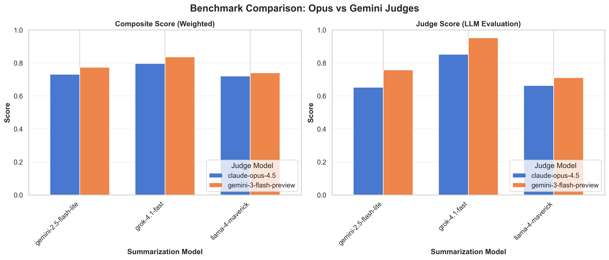
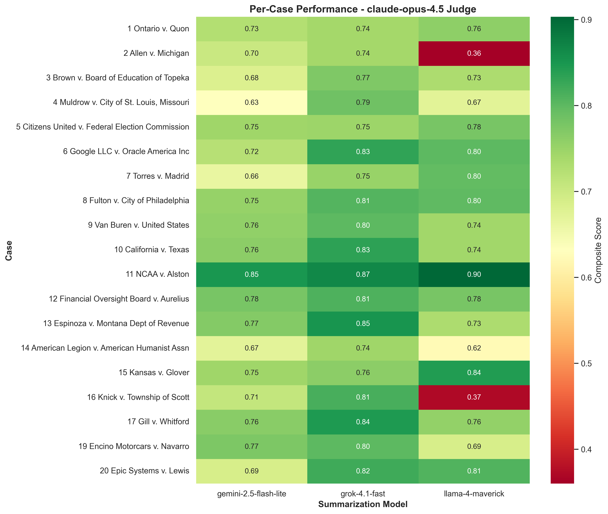
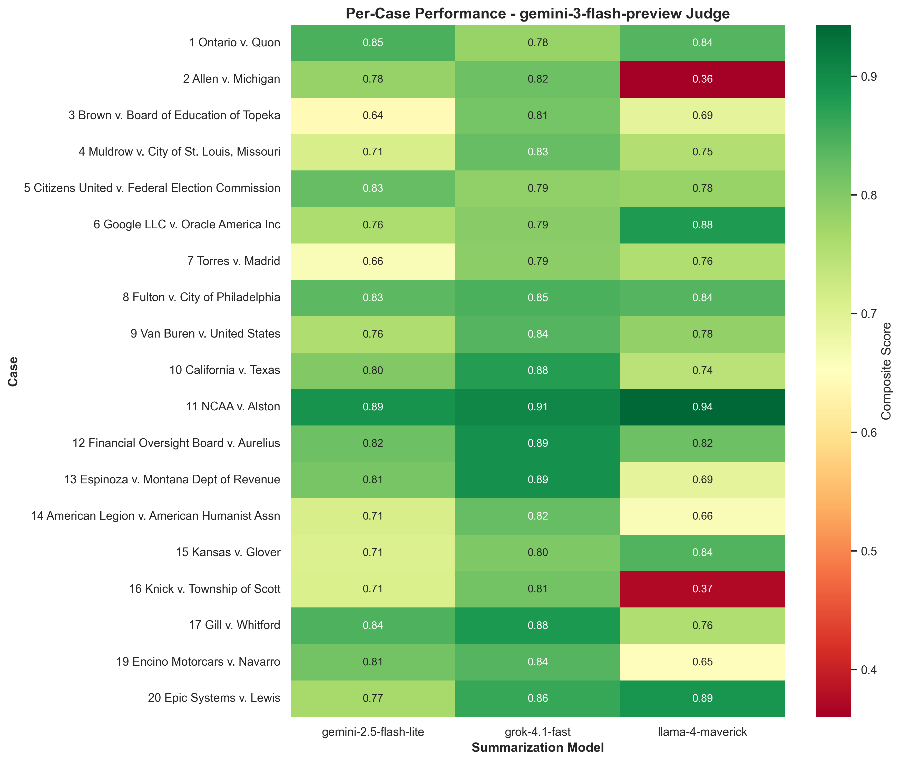
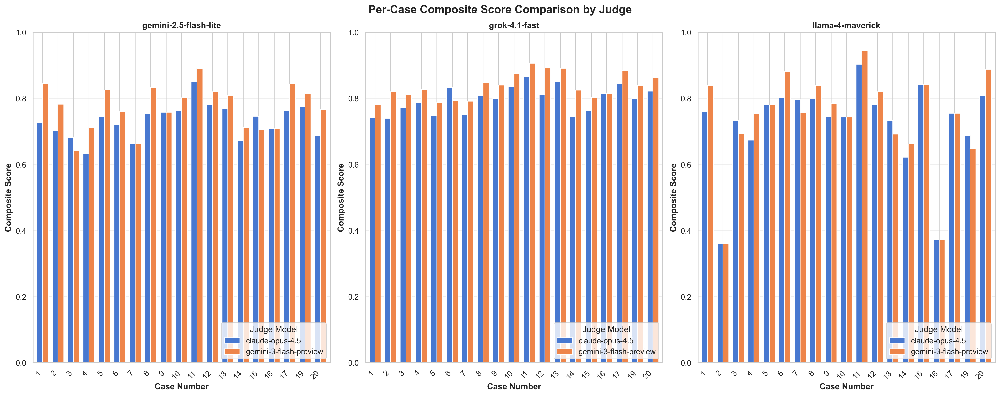
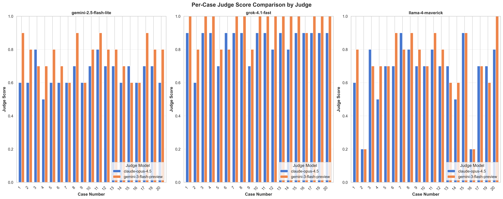
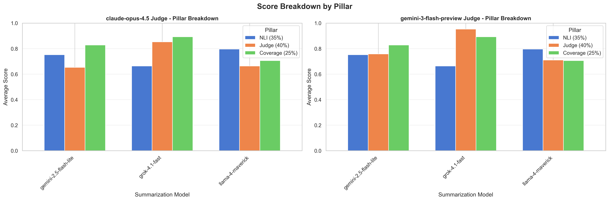
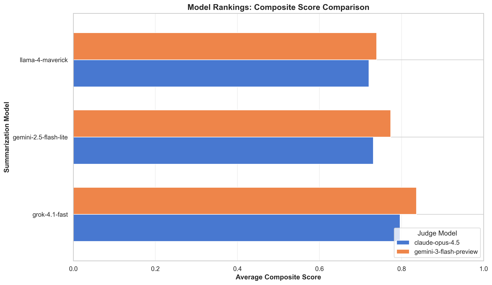

# ∑val: AI Summarization Faithfulness Benchmark

A comprehensive pipeline for evaluating the **faithfulness** of LLM-generated summaries against human-written ground truth. Designed for benchmarking how accurately AI summarizes legal documents (Supreme Court cases).

> **Why This Matters**: As LLMs become ubiquitous for summarizing legal documents, medical records, and research papers, **faithfulness** (factual accuracy) becomes paramount. This benchmark provides a rigorous, multi-faceted evaluation framework to measure whether AI summaries are trustworthy, not just fluent.


---

## What This Project Does

1. **Extracts** text from Supreme Court opinion PDFs
2. **Generates** summaries using multiple LLMs via OpenRouter
3. **Evaluates** faithfulness using a 3-pillar methodology
4. **Scores** and ranks models utilizing a "Bucket Scoring" severity rubric
5. **Logs** all results with full prompts for reproducibility
6. **Visualizes** performance across cases and judges

---

## Three-Pillar Evaluation Methodology
 
We use three complementary approaches to assess how faithfully an LLM summary represents the source material.
 
### Pillar 1: NLI Contradiction Detection (35% weight)
 
> **Summary**: Detects factual contradictions between the generated summary and the ground truth using a specialized cross-encoder model.
 
**Technical Implementation**:
- **Model**: `MoritzLaurer/DeBERTa-v3-base-mnli-fever-anli` (runs locally via HuggingFace).
- **Process**: **Ground-Truth Anchored Scoring**. For each sentence in the *Ground Truth*, we check if **ANY** sentence in the LLM Summary contradicts it.
- **Scoring**: `Score = 1.0 - (Contradicted GT Sentences / Total GT Sentences)`.

**Why Ground-Truth Anchored?**

We switched from a "Pairwise Average" approach to prevent **score inflation**:

| Approach | Method | Problem |
|----------|--------|---------|
| **Old (Pairwise)** | Average all GT×Summary sentence pairs | A verbose summary with 100 fluff sentences dilutes contradictions |
| **New (GT-Anchored)** | Mark GT sentence as contradicted if ANY summary sentence contradicts it | Focuses on whether key facts are preserved |

**Example**:
- Ground Truth: "The Court ruled 5-4 in favor of the plaintiff."
- Bad Summary: "The Court ruled 4-5 against the plaintiff. The weather was nice. The building had nice architecture. [+97 more fluff sentences]"

**Old Score**: ~99% (1 contradiction / 100 pairs = 1% error)  
**New Score**: 0% (1/1 key facts contradicted)

The new approach correctly penalizes factual errors regardless of verbosity.
 
---
 
### Pillar 2: LLM-as-a-Judge (Bucket Scoring) (40% weight)
 
> **Summary**: Uses a high-intelligence LLM to audit summaries for legal accuracy, enforcing a strict 1-5 integer scale based on error severity.
 
**Technical Implementation**:
- **Models**: We evaluate with **two judge models** for robustness:
  - `anthropic/claude-opus-4.5` (Primary)
  - `google/gemini-3-flash-preview` (Secondary)
- **Prompt Strategy**: "Pedantic Legal Scholar" persona with a **Severity Bucket** rubric.
  - **5 (Perfect)**: Flawless coverage.
  - **4 (Minor)**: Missed concurrence or trivial date error.
  - **3 (Major)**: Missed *Dissent* or substantial hallucination.
  - **2 (Critical)**: Missed *Holding* or reversed legal outcome.
  - **1 (Fail)**: Incoherent.
- **Scoring**: Integer scores are normalized (e.g., 3/5 → 0.6).
- **Why**: Captures nuance that embeddings miss (e.g., difference between "holding" and "dissent").
 
---
 
### Pillar 3: Embedding-Based Coverage (25% weight)
 
> **Summary**: Measures the semantic recall of the summary to ensure it covers all key information present in the ground truth.
 
**Technical Implementation**:
- **Model**: `sentence-transformers/all-MiniLM-L6-v2` (Local).
- **Process**: Embeds all sentences into vector space. For each ground truth sentence, we search for a corresponding summary sentence with Cosine Similarity > 0.5.
- **Scoring**: `Score = Matches / Total Ground Truth Sentences`.
- **Why**: Ensures *completeness*—the summary can be true (NLI pass) but useless if it skips 90% of the case.

---

## Composite Scoring Formula

```
Faithfulness = 0.35 * NLI_Score + 0.40 * Judge_Score + 0.25 * Coverage_Score
```

**Why these weights?**
- **Judge (40%)**: Highest weight because it captures nuanced quality
- **NLI (35%)**: Important for catching factual errors
- **Coverage (25%)**: Ensures completeness but doesn't penalize conciseness

---

## Benchmark Results

*(Results updated automatically in `outputs/evaluation_log.csv` | Evaluated on **19 Supreme Court cases**)*

### Overall Rankings

| Rank | Model | Score | NLI (Strict) | Judge (Quality) | Coverage (Completeness) |
|------|-------|-------|-----|-------|----------|
| 1 | **grok-4.1-fast** | **0.836** | 0.664 | **0.953** | **0.892** |
| 2 | gemini-2.5-flash-lite | 0.773 | 0.752 | 0.758 | 0.828 |
| 3 | llama-4-maverick | 0.740 | **0.796** | 0.711 | 0.706 |
 
> **Note**: Judge scores shown are averaged across **Opus 4.5** and **Gemini Flash Preview** judges.
> 
> **Insight**: Grok leads on Judge/Coverage but has lower NLI scores (more contradictions). Llama-4 has the best NLI (fewest contradictions) but lower overall composite score.

### Benchmark Visualizations

#### Overall Model Performance

*Composite and Judge scores across summarization models, compared by judge (Opus vs Gemini)*

#### Per-Case Performance Heatmaps

*Claude Opus 4.5 judge scores across all 19 cases*


*Gemini 3 Flash Preview judge scores across all 19 cases*

#### Per-Case Comparisons

*Side-by-side composite scores for each case, showing where judges agree/disagree*


*Side-by-side judge scores for each case, highlighting evaluation differences*

#### Pillar Breakdown

*NLI, Judge, and Coverage score breakdown by judge model*

#### Model Rankings

*Final model rankings by composite score*

---

## Dataset

The benchmark evaluates on **19 landmark Supreme Court cases** spanning diverse legal topics:

1. Ontario v. Quon (Privacy)
2. Allen v. Michigan (Voting Rights)
3. Brown v. Board of Education (Civil Rights)
4. Muldrow v. City of St. Louis (Employment)
5. Citizens United v. FEC (Campaign Finance)
6. Google LLC v. Oracle America (Copyright)
7. Torres v. Madrid (4th Amendment)
8. Fulton v. City of Philadelphia (Religious Freedom)
9. Van Buren v. United States (CFAA)
10. California v. Texas (Healthcare)
11. NCAA v. Alston (Antitrust)
12. Financial Oversight Board v. Aurelius (Bankruptcy)
13. Espinoza v. Montana Dept of Revenue (Education)
14. American Legion v. American Humanist Assn (Establishment Clause)
15. Kansas v. Glover (4th Amendment)
16. Knick v. Township of Scott (Takings Clause)
17. Gill v. Whitford (Gerrymandering)
19. Encino Motorcars v. Navarro (Labor Law)
20. Epic Systems v. Lewis (Arbitration)

**Ground Truth Source**: [Oyez.org](https://www.oyez.org/) - a trusted legal resource providing expert-written summaries.

---

## Models Used

### Summarization Models (via OpenRouter)
| Model | Provider | Purpose |
|-------|----------|---------|
| `google/gemini-2.5-flash-lite` | Google | Fast, capable summarization |
| `x-ai/grok-4.1-fast` | xAI | High-quality legal reasoning |
| `meta-llama/llama-4-maverick` | Meta | Open-source comparison |

### Evaluation Models
| Model | Provider | Purpose |
|-------|----------|---------|
| `anthropic/claude-opus-4.5` | Anthropic (via OpenRouter) | Primary LLM-as-Judge |
| `google/gemini-3-flash-preview` | Google (via OpenRouter) | Secondary LLM-as-Judge |
| `MoritzLaurer/DeBERTa-v3-base-mnli-fever-anli` | HuggingFace (local) | NLI contradiction detection |
| `sentence-transformers/all-MiniLM-L6-v2` | HuggingFace (local) | Sentence embeddings |

---

## Project Structure

```
SCAI-Hackathon-2026/
├── main.py                 # Pipeline orchestrator
├── config.py               # All configurable settings
├── .env                    # API keys (OPENROUTER_API_KEY)
├── oyez-data/              # Input: 19 PDFs + human summaries
│   ├── 1 Ontario v. Quon full case.pdf
│   ├── 1 Ontario v. Quon summary.txt
│   └── ...
├── src/
│   ├── pdf_extractor.py    # PDF text extraction
│   ├── openrouter_client.py # API client with rate limiting
│   ├── summarizer.py       # LLM summarization
│   └── evaluators/
│       ├── nli_evaluator.py          # Pillar 1: NLI Contradiction Detection
│       ├── judge_evaluator.py        # Pillar 2: LLM-as-Judge
│       ├── coverage_evaluator.py     # Pillar 3: Embedding Coverage
│       ├── meta_evaluator.py         # Phase 1: Judge Meta-Evaluation
│       ├── baseline_evaluator.py     # Phase 2: ROUGE & BERTScore Comparisons
│       ├── error_taxonomy.py         # Phase 3: Legal Error Classification
│       └── bias_auditor.py           # Phase 4: Length Bias & Self-Consistency
├── scripts/
│   ├── rerun_nli.py        # Re-evaluate NLI scores
│   └── visualize_benchmarks.py # Generate visualizations
├── outputs/
│   ├── extracted_texts/    # Raw PDF text
│   ├── llm_summaries/      # Generated summaries
│   ├── nli_results/        # NLI evaluation JSON files
│   ├── judge_results/      # Judge evaluation JSON files (3 judges)
│   ├── coverage_results/   # Coverage analysis JSON files
│   ├── self_consistency/   # Re-evaluation results for bias auditing
│   ├── visualizations/     # Benchmark charts
│   ├── results.json                    # Complete structured results
│   ├── meta_evaluation_report.md       # Judge agreement analysis
│   ├── baseline_evaluation_report.md   # ROUGE/BERTScore comparison
│   ├── error_taxonomy_report.md        # Legal error classification
│   ├── bias_audit_report.md            # Length bias & self-consistency
│   ├── summary_report.md               # Human-readable pipeline report
│   └── evaluation_log.csv              # Historical log of all runs
```

---

## Quick Start

### 1. Setup

```bash
# Clone and enter project
cd SCAI-Hackathon-2026

# Install dependencies
uv sync

# Set API key
echo "OPENROUTER_API_KEY=your_key_here" > .env
```

### 2. Run Pipeline

```bash
uv run python main.py
```

### 3. View Results

- **Human-readable**: `outputs/summary_report.md`
- **Structured data**: `outputs/results.json`
- **Visualizations**: `outputs/visualizations/`

### 4. Generate Visualizations

```bash
uv run python scripts/visualize_benchmarks.py
```

---

## Configuration

Edit `config.py` to customize:

```python
# Add/remove summarization models
SUMMARIZATION_MODELS = [
    "google/gemini-2.5-flash-lite",
    "x-ai/grok-4.1-fast",
    "meta-llama/llama-4-maverick",
    # Add new models here
]

# Judge models to use
JUDGE_MODELS = [
    "anthropic/claude-opus-4.5",
    "google/gemini-3-flash-preview",
]

# Adjust scoring weights
COMPOSITE_WEIGHTS = {
    "nli": 0.35,
    "judge": 0.40,
    "coverage": 0.25,
}

# Adjust coverage threshold
COVERAGE_THRESHOLD = 0.5  # Similarity cutoff for "covered"
```

---

## Interpreting Results

### Score Ranges
| Score | Interpretation |
|-------|----------------|
| 0.90+ | Excellent faithfulness |
| 0.75-0.89 | Good, minor issues |
| 0.60-0.74 | Moderate issues |
| < 0.60 | Significant problems |

### Failure Modes Tracked
- **Contradictions**: Claims that conflict with source
- **Omissions**: Key information not covered
- **Hedging**: Vague or uncertain language

---

## Evaluation Beyond Scoring: Meta-Analysis

Beyond scoring summaries, we validate the benchmark itself through four meta-analysis phases.

### Phase 1: Judge Meta-Evaluation

Measures inter-judge agreement to answer: *"Do our judges agree with each other?"*

| Judge Pair | Kendall's τ | Cohen's κ (Completeness) |
|---|---|---|
| Opus ↔ Gemini | 0.65 (moderate) | 0.86 (near-perfect) |
| Opus ↔ MiniMax | 0.30 (weak) | 0.30 (fair) |
| Gemini ↔ MiniMax | 0.38 (weak) | 0.39 (fair) |

**Key Finding**: MiniMax is the weakest judge — it disagrees with both Opus and Gemini.

```bash
# Run meta-evaluation
python -m src.evaluators.meta_evaluator
```

### Phase 2: Baseline Metric Comparisons

Compares our composite against traditional metrics (ROUGE, BERTScore).

| Metric | Kendall's τ vs Composite | p-value |
|---|---|---|
| ROUGE-1 F | **-0.078** | 0.39 |
| ROUGE-L F | **-0.173** | 0.06 |
| BERTScore F1 | **-0.203** | 0.03 |

**Key Finding**: ROUGE and BERTScore are **negatively correlated** with our composite — they literally rank models in the opposite order. This is the strongest evidence for the multi-pillar approach.

```bash
# Run baseline comparison
python -m src.evaluators.baseline_evaluator
```

### Phase 3: Legal Error Taxonomy

Classifies 777 failures into legal-domain-specific categories.

| Error Type | Count | % |
|---|---|---|
| Fabricated Precedent / Citation | 134 | 51.5% |
| Invented Detail | 13 | 5.0% |
| Wrong Holding | 12 | 4.6% |
| Omitted Concurrence | 146 | 28.2% (of omissions) |
| Omitted Dissent | 98 | 19.0% (of omissions) |

**Key Finding**: Over half of all errors are hallucinated details — names, dates, and specifics that look plausible but aren't in the source. Llama-4 has 9 Wrong Holdings — the most dangerous legal error.

```bash
# Run error taxonomy
python -m src.evaluators.error_taxonomy
```

### Phase 4: Bias Auditing

Tests for systematic biases that could undermine evaluation reliability.

**Length Bias**: No judge has |r| > 0.3 — scores are not driven by summary length. ✅

**Self-Consistency (Test-Retest Reliability)**:

| Judge | Mean Δ Score | Exact Match Rate |
|---|---|---|
| claude-opus-4.5 | **0.000** | **100%** |
| gemini-3-flash-preview | **0.000** | **100%** |
| minimax-m2.1 | 0.060 | 60% |

**Key Finding**: Opus and Gemini produce **identical scores** when re-evaluating the same summary (temperature=0). MiniMax shows variation, confirming it's the least reliable judge.

```bash
# Run bias audit (with API calls for self-consistency)
python -m src.evaluators.bias_auditor

# Run length bias only (no API calls)
python -m src.evaluators.bias_auditor --skip-consistency
```

---

## Limitations

This benchmark evaluates **faithfulness** specifically. It does **not** measure:

- **Readability**: How accessible the summary is to non-experts
- **Conciseness**: Whether the summary is optimally brief
- **Stylistic Quality**: Writing elegance or legal tone
- **Reasoning Depth**: Whether the summary explains legal reasoning vs. just stating outcomes
- **Multi-document Synthesis**: All evaluations are single-document summaries

Additionally:
- Ground truth summaries are from Oyez.org and may have their own biases
- Judge models may disagree on subjective quality assessments
- NLI model may miss subtle semantic contradictions

---

## Future Work

- **Expand Dataset**: Add more cases from different legal domains (criminal, corporate, IP)
- **Multi-Judge Consensus**: Implement weighted judge averaging based on historical accuracy
- **Reasoning Evaluation**: Add a 4th pillar measuring quality of legal reasoning
- **Human Evaluation**: Validate judge scores against expert legal reviewers
- **Cross-Domain Benchmark**: Test on medical summaries, research abstracts, etc.
- **Adversarial Testing**: Generate challenging edge cases (sarcasm, complex nested rulings)

---

## Resume Support

The pipeline **automatically resumes** if interrupted:
- Existing summaries are skipped
- Only new model/case combinations are generated
- Safe to add models and re-run

---

## Technical Details

### Rate Limiting
- 10-second delay between OpenRouter requests
- Exponential backoff on 429 errors (10s -> 20s -> 40s -> 80s -> 160s)
- 180-second timeout for long responses

### Local Models
- NLI and embedding models run on CPU by default
- First run downloads models from HuggingFace (~500MB)

### Intermediate Results
All results are saved immediately after generation:
- Safe to interrupt and resume
- Each evaluation step saves its own JSON file

---

## License

MIT License

---

## Acknowledgments

- [Oyez.org](https://www.oyez.org/) for ground truth legal summaries
- [HuggingFace](https://huggingface.co/) for NLI and embedding models
- [OpenRouter](https://openrouter.ai/) for unified LLM API access

---

## Change Log

### 2026-02-12: Comprehensive Meta-Analysis & Benchmark Validation

**Added 4 meta-analysis modules** that validate the benchmark itself:

1. **Judge Meta-Evaluation** (`meta_evaluator.py`) — Kendall's Tau, Cohen's Kappa, pillar correlation matrix
2. **Baseline Comparisons** (`baseline_evaluator.py`) — ROUGE & BERTScore vs composite (negative correlation found!)
3. **Error Taxonomy** (`error_taxonomy.py`) — 777 errors classified into 9 legal categories (51.5% are hallucinations)
4. **Bias Auditing** (`bias_auditor.py`) — Length bias + self-consistency (Opus & Gemini: 100% test-retest reliability)

**Key Findings**:
- ROUGE/BERTScore rank models in the *opposite order* from our composite (τ = -0.20)
- Opus and Gemini agree on completeness (κ = 0.86), MiniMax is the weakest judge
- The #1 error type is "Fabricated Precedent" — LLMs hallucinate plausible-looking legal details
- No length bias detected in any judge

### 2026-02-07: NLI Scoring Methodology Overhaul
**Why**: The previous "Pairwise Average" approach allowed verbose summaries to inflate scores by diluting contradictions with fluff.

**What Changed**:
- **Old Method**: Averaged contradiction scores across all (Ground Truth sentence × Summary sentence) pairs
- **New Method**: "Ground-Truth Anchored" — marks a GT sentence as contradicted if ANY summary sentence contradicts it
- **Impact**: Scores became more rigorous and reflective of actual factual accuracy

**Other Changes**:
- Implemented "Bucket Scoring" (1-5 integer scale) for Judge evaluations with severity-based rubrics
- Added persistent `evaluation_log.csv` with full prompt logging for reproducibility
- Added comprehensive benchmark visualizations
- Deployed dual-judge evaluation (Opus + Gemini) for robustness
- Updated all documentation to reflect new methodology
